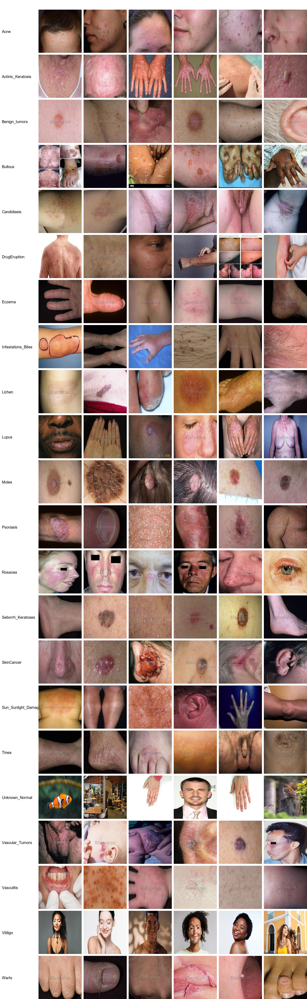

# 9768 Images of Skin Diseases with 22 Categories

Dataset Type: Image classification for use in target detection without annotated files
Dataset Format: Only contains JPG images, each category folder contains the corresponding image
Number of Images (JPG file count): 9768
Number of Categories: 22
Category Names: ['Acne', 'Actinic Keratosis', 'Benign Tumors', 'Bullous', 'Candidiasis', 'Drug Eruption', 'Eczema', 'Infestations Bites', 'Lichen', 'Lupus', 'Moles', 'Psoriasis', 'Rosacea', 'Seborrheic Keratoses', 'Skin Cancer', 'Sunlight Damage', 'Tinea', 'Unknown Normal', 'Vascular Tumors', 'Vasculitis', 'Vitiligo', 'Warts']
Image Count per Category:  
Training Set Image Count: 8788
- Acne (Acne) Training Set Image Count: 376
- Actinic Keratosis (Actinic Keratosis) Training Set Image Count: 461
- Benign Tumors (Benign Tumors) Training Set Image Count: 687
- Bullous (Bullous) Training Set Image Count: 312
- Candidiasis (Candidiasis) Training Set Image Count: 148
- Drug Eruption (Drug Eruption) Training Set Image Count: 329
- Eczema (Eczema) Training Set Image Count: 639
- Infestations Bites (Infestations Bites) Training Set Image Count: 333
- Lichen training set image count: 355
- Lupus training set image count: 183
- Moles training set image count: 237
- Psoriasis training set image count: 502
- Rosacea training set image count: 158
- Seborrheic Keratosis training set image count: 280
- Skin Cancer training set image count: 420
- Sunlight Damage training set image count: 219
- Tinea training set image count: 599
- Unknown Normal training set image count: 1091
- Vascular Tumors training set image count: 335
- Vasculitis training set image count: 298
- Vitiligo training set image count: 460
- Warts training set image count: 366
- Validation set image count: 980
Acne (acne rosacea): Verification set images: 39
Actinic keratosis : Verification set images: 59
Benign_Tumors : Verification set images: 80
Bullous:Verification set images: 42
Candidiasis (Candida infection): Verification set images: 22
Drug Eruption : Verification set images: 37
Eczema (eczema): Verification set images: 63
Infestations_Bites:Verification set images: 41
Lichen : Verification set images: 43
Lupus : Verification set images: 26
Moles : Verification set images: 25
Psoriasis (psoriasis): Verification set images: 50
Rosacea is a common skin condition characterized by red, inflamed, and often painful bumps on the face. The term "rosacea" comes from the Latin word "rosa," which refers to the color of roses, and "caecus," which means "to burn."

The exact cause of rosacea is unknown, but it is believed to be caused by an overproduction of oil in the skin's pores, which can lead to inflammation and infection. Other factors that may contribute to the development of rosacea include sun exposure, hormonal changes, and stress.

Symptoms of rosacea include flushing, redness, swelling, and pain around the nose, cheeks, and forehead. It is important to seek medical attention if you have any of these symptoms, as they can be difficult to treat without proper diagnosis and treatment.

There are several treatment options for rosacea, including topical creams, oral medications, and laser therapy. It is important to speak with your doctor about the best course of treatment for your individual case.
Seborrheic Keratoses : Verification set images: 25
SkinCancer : Verification set images: 50
- Sun_Sunlight_Damage:validation set image count: 21
- Tinea:validation set image count: 65
- Unknown_Normal:validation set image count: 120
- Vascular_Tumors:validation set image count: 38
Vasculitis : Validation set image count: 30
- Vitiligo:validation set image count: 51
- Warts:validation set image count: 37
test set image count: 0  
Total image count: 415
- Acne: total image count: 415
- Actinic_Keratosis: total image count: 520
- Benign_tumors: total image count: 767
- Bullous: total image count: 354
- Candidiasis: total image count: 170
- DrugEruption: total image count: 366
Eczema: 702 images
Infestations/Bites: 374 images
Lichen: 398 images
Lupus: 209 images
Moles: 262 images
Psoriasis: 552 images
Rosacea: 174 images
Seborrheic Keratoses: 305 images
Skin Cancer: 470 images
Sunlight Damage: 240 images
Tinea: 664 images
Unknown/Normal: 1211 images
Vascular Tumors: 373 images
Vasculitis: 328 images
Vitiligo: 511 images
- Warts (Warts): Total image count: 403
Important notes: No  
Special statement: This dataset does not guarantee the accuracy of the trained model or weight file.
Image preview:
## Images

Here is a pay link on Stripe ( https://buy.stripe.com/3cs8yP7sY87d0vu9AB ). Please contact me lonlonago@foxmail.com after funding $89, and I will send you a complete data files , thank you!

